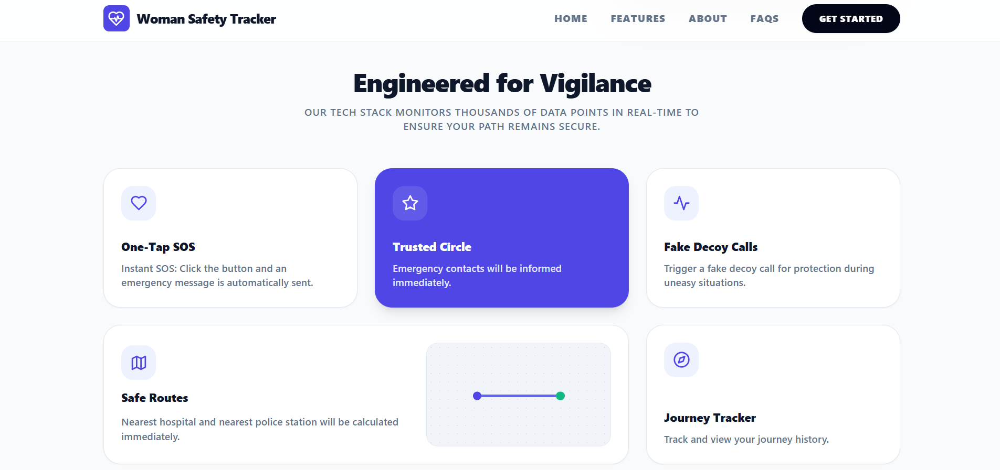
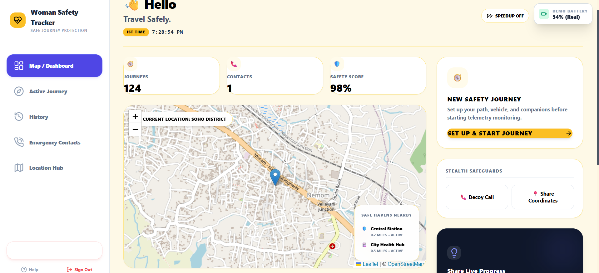
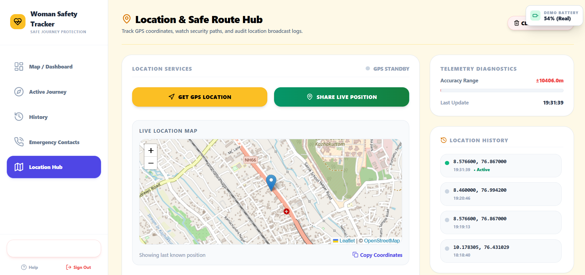
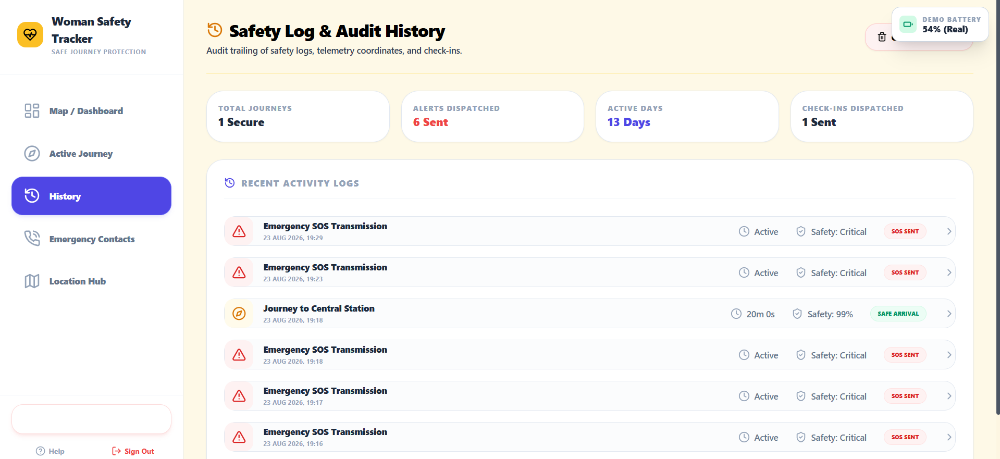

# Women Safety Tracker: A Journey Protection and Emergency Alert System

[](https://react.dev/)
[](https://www.typescriptlang.org/)
[](https://vitejs.dev/)
[](https://tailwindcss.com/)
[](https://expressjs.com/)
[](https://www.twilio.com/)
[](LICENSE)

A web-based journey protection and emergency dispatch platform engineered around a deterministic **dead-man's switch** safety model. Developed as an internship research and engineering project at the **MINDS Research Lab, Indian Institute of Information Technology Kottayam (IIIT Kottayam)**.

---

## 📑 Table of Contents
- [Overview](#overview)
- [Internship Context](#internship-context)
- [Problem Statement](#problem-statement)
- [Objectives](#objectives)
- [Features & Implementation Status](#features--implementation-status)
- [Application Screenshots](#application-screenshots)
- [Technology Stack](#technology-stack)
- [System Architecture](#system-architecture)
- [Project Structure](#project-structure)
- [Prerequisites](#prerequisites)
- [Installation & Local Setup](#installation--local-setup)
- [Environment Configuration](#environment-configuration)
- [Twilio Setup Guide](#twilio-setup-guide)
- [Running Locally](#running-locally)
- [Testing the System](#testing-the-system)
- [Live Demo & Hosting Limitations](#live-demo--hosting-limitations)
- [Troubleshooting](#troubleshooting)
- [Known Limitations](#known-limitations)
- [Future Improvements](#future-improvements)
- [Internship Documentation](#internship-documentation)
- [License](#license)

---

## 🎯 Overview
Most personal safety solutions are purely **reactive**—they require a user to consciously press a panic button or trigger a physical gesture during an assault or emergency. In high-threat, incapacitating, or coercive scenarios, a victim is frequently unable to reach or operate their phone.

**Women Safety Tracker** introduces an active journey protection paradigm. Operating on a **dead-man's switch** principle, the user registers journey metadata (vehicle, route, companion info) and arms a 20-minute safety timer secured with a 4-digit PIN. If the user fails to check in before the countdown and an audio-visual grace period elapse, the system automatically triggers an emergency SOS dispatch via Twilio SMS carrying full journey context and a real-time Google Maps GPS link to pre-registered emergency contacts.

---

## 🎓 Internship Context
* **Project**: Women Safety Tracker: A Journey Protection and Emergency Alert System
* **Author**: Gokul R S (Adi Shankara Institute of Engineering and Technology, Kalady)
* **Supervisor / Guidance**: Dr. P. Victer Paul
* **Host Institution**: MINDS Research Lab, Indian Institute of Information Technology Kottayam (IIIT Kottayam)
* **Tenure**: May 2026 – July 2026

---

## ❗ Problem Statement
1. **The Inaction Dilemma**: Conventional panic button systems fail when the victim is incapacitated, coerced, or prevented from interacting with their mobile device.
2. **Missing Journey Context**: When standard alerts are sent, contacts receive only bare coordinates without details about the transit mode, vehicle number, or intended destination.
3. **Forced Cancellation Vulnerability**: Attackers who discover a phone during a journey often force the user to unlock the device and cancel the alarm.
4. **App Installation Barriers**: Native apps require both the user and their emergency guardians to install matching proprietary apps, maintain background services, and navigate app store setups.

---

## 🎯 Objectives
* Implement an active countdown safety timer that dispatches alerts if the user fails to check in.
* Incorporate a covert **Duress PIN** mechanism that appears to disable tracking while silently broadcasting an SOS.
* Enforce automatic SOS triggers after **3 consecutive failed PIN attempts**.
* Provide real-time GPS coordinate extraction via modern browser APIs and embed location hyperlinks directly in SMS alerts.
* Integrate device sensor APIs (Battery Status, Web Audio siren, and Vibration haptics) to provide proactive warnings and deterrents.
* Deliver safe-corridor navigation calculating routes to the nearest hospital or police precinct using OpenStreetMap and OSRM.

---

## 🔍 Features & Implementation Status

To provide complete transparency between prototype capabilities and production designs, features are categorized below:

### A. Fully Implemented Features (Operational in Code)
* **Active Journey Timer (Dead-Man's Switch)**: Configurable 20-minute journey session requiring a user-defined 4-digit PIN to stop or extend.
* **30-Second Alarm Grace Period**: When the timer reaches zero, a 30-second warning state activates with browser-synthesized audio alarm (Web Audio API) and haptic vibration (`navigator.vibrate`).
* **Covert Duress PIN (`9999`)**: Entering `9999` immediately triggers the background Twilio SOS dispatch while displaying a deceptive `"Tracker is disabled"` screen to appease an aggressor.
* **Tamper-Resistant PIN Retry**: Enforces a strict 3-attempt limit. Three consecutive incorrect PINs immediately trigger emergency SOS dispatch.
* **Geolocation Capture**: Fetches high-accuracy latitude and longitude coordinates via the browser `navigator.geolocation` API and generates dynamic Google Maps links.
* **Twilio Emergency SMS Dispatch**: Dedicated Node.js/Express backend endpoint (`/api/sos`) formatting E.164 phone numbers and transmitting SMS alerts with journey metadata.
* **Dry-Run Simulation Mode**: When Twilio credentials are not configured in `.env`, the backend simulates successful dispatch in console logs for safe offline development.
* **Emergency Contacts Directory**: Client-side contact management allowing users to register trusted contacts stored in browser `localStorage`.
* **Safe-Route & Emergency Amenity Locator**: Queries OpenStreetMap Overpass API for nearby hospitals and police stations, displaying routes and distance calculations via OSRM.
* **Decoy / Fake Call Generator**: Full-screen simulated incoming call screen with realistic ring and answer states to assist users in excusing themselves from uncomfortable situations.
* **Audit Trail & Safety Log**: Local audit trailing saving all SOS broadcasts, timestamps, check-ins, and session durations to `localStorage`.
* **Dark / Light Theme**: Theme provider with persistent system and user preference toggles.

### B. Demonstration & Simulation Features
* **Battery Monitoring & Simulator**: Monitors battery level via Chromium `navigator.getBattery()`. Includes a built-in UI simulator widget allowing testers to manually test low-battery warning (<=15%) and critical battery alerts (<5%).
* **Client-Side Session Storage**: User profiles and contacts persist in browser `localStorage` rather than an external database.
* **Local Authentication Demo**: The sign-in page allows testers to enter any email and password for local session generation without requiring an external identity provider.

### C. Out of Scope / Planned for Future Work (Documented in Report)
* Native background execution when mobile browser is killed or phone screen is locked.
* Twilio WhatsApp Sandbox / Push notification integration (the current backend sends standard SMS).
* Centralized server database with encrypted user credential hashing.
* Direct integration with Government Emergency Response Support Systems (ERSS 112).

---

## 📱 Application Screenshots

### Landing Page & FAQs
<p align="center">
  
  
</p>

### Safety Dashboard & Journey Setup
<p align="center">
  
  
</p>

### PIN Verification & Covert Duress Mode
<p align="center">
  
  
</p>

### Emergency SOS Trigger & Alerts
<p align="center">
  
  
</p>

### Emergency Route Navigation & Safe Corridors
<p align="center">
  
  
</p>

### Telemetry Coordinates & Safety History Log
<p align="center">
  
  
</p>

### Proactive Battery Monitoring Alerts
<p align="center">
  
  
</p>

---

## 🛠️ Technology Stack

| Layer | Technology | Purpose |
|---|---|---|
| **Frontend Framework** | React 18 + TypeScript | Type-safe, component-driven user interface |
| **Build & Tooling** | Vite 7 | High-performance build tool & dev server with backend API proxy |
| **Styling** | Tailwind CSS 3 | Responsive, utility-first mobile and desktop styling |
| **Mapping & GIS** | Leaflet, React-Leaflet, OpenStreetMap | Interactive mapping, coordinate pinning, route overlays |
| **Icons** | Lucide React | Modern interface iconography |
| **Backend Service** | Node.js + Express 4 (`/server`) | REST API gateway handling alert construction and Twilio dispatch |
| **SMS Gateway** | Twilio Programmable SMS SDK | Telecommunications gateway broadcasting emergency SMS |
| **Concurrently** | Concurrently 9 | Single command orchestrating frontend and backend processes |

---

## 🏛️ System Architecture

```text
┌─────────────────────────────────────────────────────────────────────────┐
│                           CLIENT BROWSER (Vite + React)                 │
│                                                                         │
│   ┌─────────────────────┐    ┌──────────────────┐    ┌──────────────┐   │
│   │   Safety Engine     │    │  Device APIs     │    │ localStorage │   │
│   │  - 20-min Countdown │    │  - Geolocation   │    │  - Contacts  │   │
│   │  - Grace Siren      │    │  - Battery API   │    │  - Profile   │   │
│   │  - PIN / Duress     │    │  - Web Audio/Vibe│    │  - Log Trail │   │
│   └──────────┬──────────┘    └──────────────────┘    └──────────────┘   │
└──────────────┼──────────────────────────────────────────────────────────┘
               │  POST /api/sos (Proxied via Vite dev server)
               ▼
┌─────────────────────────────────────────────────────────────────────────┐
│                       LOCAL BACKEND (Node.js + Express)                 │
│                                                                         │
│   ┌─────────────────────────────────────────────────────────────────┐   │
│   │  server/index.js                                                │   │
│   │  - Loads root .env variables securely                           │   │
│   │  - Validates E.164 phone number formatting                      │   │
│   │  - Formats journey metadata + Google Maps coordinate link       │   │
│   │  - Dispatches SMS via Twilio SDK (or dry-run if unconfigured)  │   │
│   └────────────────────────────────┬────────────────────────────────┘   │
└────────────────────────────────────┼────────────────────────────────────┘
                                     │
                                     ▼
                      ┌──────────────────────────────┐
                      │    Twilio SMS Gateway API    │
                      └──────────────┬───────────────┘
                                     │  SMS Broadcast
                                     ▼
                      ┌──────────────────────────────┐
                      │ Emergency Contacts' Handsets │
                      └──────────────────────────────┘
```

---

## 📂 Project Structure

```text
MySafeApp/
├── .env.example              # Centralized environment variable template
├── .gitignore                # Git ignore rules (node_modules, .env, dist)
├── LICENSE                   # MIT License
├── README.md                 # Complete project documentation
├── index.html                # Application HTML entry point
├── package.json              # Root project dependencies & unified scripts
├── tsconfig.json             # TypeScript configuration
├── vite.config.ts            # Vite build configuration with /api reverse proxy
├── docs/                     # Academic & internship resources
│   └── Women Safety Tracker Internship Report .docx
├── public/                   # Static assets & favicon
│   └── vite.svg
├── server/                   # Express backend service
│   ├── .env.example          # Server environment reference
│   ├── index.js              # Express REST API & Twilio dispatch logic
│   └── package.json          # Backend dependencies (express, cors, twilio, dotenv)
└── src/                      # Frontend application source
    ├── App.tsx               # Main safety state engine, timer, PIN modal, and router
    ├── main.tsx              # React DOM root mounting
    ├── index.css             # Tailwind base and global style rules
    ├── components/           # Reusable UI widgets (Map, FakeCall, Layout, Nav)
    ├── contexts/             # Global providers (AuthContext, ThemeContext)
    ├── hooks/                # Custom React hooks (useLocation)
    ├── pages/                # Screens (Dashboard, ActiveJourney, Contacts, History, etc.)
    └── utils/                # Helper functions
```

---

## 📋 Prerequisites
Before running the application locally, ensure you have:
* **Node.js** (v18.x or v20.x recommended) – [Download Node.js](https://nodejs.org/)
* **npm** (comes packaged with Node.js)
* **A Twilio Account** (Free Trial account works) – [Sign up at Twilio](https://www.twilio.com/)

---

## 💻 Installation & Local Setup

### 1. Clone the Repository
```bash
git clone https://github.com/your-username/women-safety-tracker.git
cd women-safety-tracker/MySafeApp
```

### 2. Install Root & Server Dependencies
Install dependencies for both the frontend and backend:
```bash
# Install frontend dependencies
npm install

# Install backend dependencies
cd server
npm install
cd ..
```

---

## 🔐 Environment Configuration

The application uses a single `.env` file placed at the root of the project (`MySafeApp/.env`). The Express backend is configured to resolve this file regardless of the directory from which it is launched.

1. Create your local `.env` from the provided template:
   ```bash
   cp .env.example .env
   ```
2. Open `.env` and fill in your configuration:
   ```env
   # ==========================================
   # TWILIO CREDENTIALS (BACKEND)
   # ==========================================
   TWILIO_ACCOUNT_SID=ACxxxxxxxxxxxxxxxxxxxxxxxxxxxxxxxx
   TWILIO_AUTH_TOKEN=your_auth_token_here
   TWILIO_FROM_NUMBER=+1xxxxxxxxxx

   # Optional fallback recipient if request does not provide one
   EMERGENCY_TO_NUMBER=

   # ==========================================
   # SERVER & FRONTEND CONFIGURATION
   # ==========================================
   PORT=5000

   # Leave blank for local development (Vite proxies /api to localhost:5000)
   VITE_API_URL=
   ```

> **Security Note:** Never commit your real `.env` file to version control. The project's `.gitignore` explicitly excludes all `.env` files.

---

## 📲 Twilio Setup Guide

Follow these steps to configure SMS dispatching for testing:

1. **Create an Account**: Go to [twilio.com](https://www.twilio.com/) and register for a free account.
2. **Retrieve Credentials**:
   * Open the [Twilio Console](https://console.twilio.com/).
   * Locate your **Account SID** and **Auth Token** on the dashboard.
   * Paste them into `TWILIO_ACCOUNT_SID` and `TWILIO_AUTH_TOKEN` in `.env`.
3. **Get a Twilio Phone Number**:
   * In the console, click **Get a Trial Number** (or navigate to Phone Numbers > Manage > Active Numbers).
   * Copy the assigned phone number (e.g., `+15555550100`) into `TWILIO_FROM_NUMBER` in `.env`.
4. **Verify Recipient Phone Numbers (Mandatory for Trial Accounts)**:
   * Twilio trial accounts **can only send SMS to numbers you have verified**.
   * Go to **Phone Numbers** > **Manage** > **Verified Caller IDs**.
   * Click **Add a new Caller ID**, enter your personal phone number, and enter the verification code sent via SMS.
   * Add this verified number as an Emergency Contact in the Women Safety Tracker web interface.
5. **Phone Number Formatting**:
   * Always enter phone numbers in international **E.164 format** (e.g., `+919999999999` for India, `+15555550100` for the US).
   * If a 10-digit number without a country code is entered, the backend defaults to India (`+91`).

---

## 🚀 Running Locally

Start both the Vite frontend and Express backend concurrently with one command:

```bash
npm run dev
```

* **Frontend**: Accessible at `http://localhost:5173`
* **Backend API**: Running at `http://localhost:5000`
* **Vite Proxy**: Automatically forwards any frontend request from `http://localhost:5173/api/*` to `http://localhost:5000/api/*`.

To run frontend or backend independently (optional):
```bash
# Run only Vite frontend
npm run frontend

# Run only Express backend
npm run backend
```

---

## 🧪 Testing the System

### 1. Offline / Dry-Run Testing (No Twilio Account Required)
If you do not configure Twilio credentials in `.env`, the backend automatically runs in **dry-run mode**:
1. Run `npm run dev`.
2. Start a journey from the dashboard, set a 4-digit PIN, and trigger the SOS or let the grace period expire.
3. Check your terminal: the backend logs the simulated SOS payload, target numbers, and message content without raising an error.

### 2. End-to-End Live SMS Testing
1. Ensure your `.env` contains valid Twilio credentials and a verified recipient phone number.
2. Navigate to `http://localhost:5173` and log in (any email and password works for demo access).
3. Navigate to **Contacts** and add your verified phone number (in E.164 format, e.g., `+91XXXXXXXXXX`).
4. On the **Dashboard**, click **Start Safety Journey**, enter journey details (e.g., "Auto Rickshaw to Home"), and set a 4-digit PIN (e.g., `1234`).
5. Test one of three trigger methods:
   * **Direct Trigger**: Press and hold the emergency SOS button.
   * **Duress Trigger**: Click "Stop Journey", enter duress PIN `9999`. The UI displays a fake disabled screen while the SMS is sent.
   * **Wrong PIN Trigger**: Enter an incorrect PIN 3 times.
6. Verify receipt of the SMS on your phone. The message will read:
   ```text
   Sent from your Twilio trial account - SOS ALERT! Emergency SOS Triggered. Traveling in Auto Rickshaw to Home with Solo. Last known location: https://maps.google.com/?q=...
   ```

---

## 🌐 Live Demo & Hosting Limitations

* **Live Demo**: [Woman Safety Tracker](https://woman-safety-app.netlify.app/)
* **Hosting**: Netlify (Static Frontend)
* **Architecture Distinction**:
  * **Frontend (Client-Side)**: Deployed statically on Netlify, providing access to the UI, journey setup, maps, fake call generator, and local audit logs.
  * **Backend (Server-Side)**: The Node.js/Express service and Twilio secret keys are **not deployed on the static Netlify host**.
  * **Functionality Difference**: On the live Netlify site, triggering an SOS demonstrates client-side transitions and simulation logs, but **will not transmit actual SMS messages** unless the Express backend is hosted separately (e.g., on Render, Railway, or AWS) and linked via `VITE_API_URL`.

---

## 🔧 Troubleshooting

| Issue | Cause | Resolution |
|---|---|---|
| **SMS fails with `Permission to send an SMS has not been enabled`** | Geo-permissions restricted in Twilio | Go to Twilio Console > Messaging > Settings > Geo-Permissions and check the destination country. |
| **SMS fails with `The number is unverified`** | Using a Twilio trial account | Verify the destination number in Twilio Console under Verified Caller IDs. |
| **Backend outputs `[SOS] Twilio not configured`** | Missing or incorrect `.env` variables | Verify `TWILIO_ACCOUNT_SID` and `TWILIO_AUTH_TOKEN` are present in `MySafeApp/.env`. |
| **Location shows `Location Unavailable` in SMS** | Geolocation denied in browser | Allow location permissions in your browser address bar settings. |
| **Port 5000 in use** | Another process is holding port 5000 | Set `PORT=5001` in `.env` and adjust the target in `vite.config.ts`. |

---

## ⚠️ Known Limitations
* **Browser Sandbox**: Browser-based timers and Web Audio APIs are constrained when a mobile browser tab is backgrounded or when the phone screen is locked.
* **Trial Restrictions**: Free Twilio accounts prepend trial watermarks and cannot broadcast to arbitrary unverified numbers.
* **Storage Scope**: Emergency contacts and audit records are bound to the specific browser's `localStorage` and will not synchronize across devices.

---

## 🔮 Future Improvements
* Progressive Web App (PWA) with service workers and background geolocation synchronization.
* Native mobile client (React Native / Flutter) capable of running foreground safety services while locked.
* Twilio WhatsApp Business API integration for richer multimedia dispatches.
* Direct API bridge into municipal emergency dispatch centers (ERSS 112).
* Hardware BLE companion button (smart ring / keychain) for instant physical dispatches.

---

## 📄 Internship Documentation
The complete, unabridged academic internship report submitted for this project is archived in this repository:
* **Report File**: [`docs/Women Safety Tracker Internship Report .docx`](docs/Women%20Safety%20Tracker%20Internship%20Report%20.docx)
* **Author**: Gokul R S
* **Institution**: Adi Shankara Institute of Engineering and Technology (ASIET) & MINDS Research Lab, IIIT Kottayam

---

## 📜 License
This project is licensed under the [MIT License](LICENSE).
